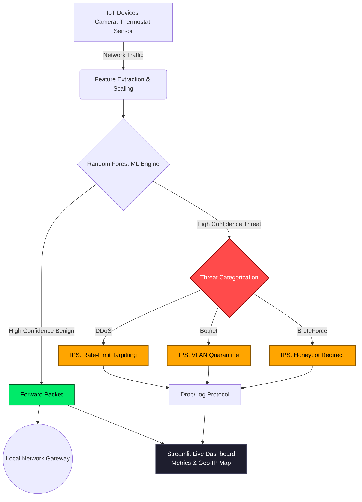

# ML-Based IDS/IPS for Anomalous Traffic Detection in Simulated IoT Environments

  

## 📌 Project Overview
This project transforms a standard IoT network gateway into an enterprise-grade **Intrusion Prevention System (IPS)**. Using a high-fidelity Random Forest machine learning model, the system analyzes IoT network traffic in real-time to detect anomalous behavior and automatically triggers zero-trust defensive protocols before threats can penetrate the local network.

This system is built specifically for high-fidelity demonstration, featuring a live threat simulation environment, Geo-IP threat intelligence mapping, and dynamic defensive responses based on specific attack vectors.

## ✨ Key Features
- **Real-Time ML Traffic Classification:** Evaluates live packet streams against a Random Forest model trained on the CICIoT2023 dataset, achieving over 99% accuracy.
- **Dynamic Threat Intelligence Mapping:** Features an integrated Leaflet.js interactive map with pulsating CSS animations that visualizes attack origins globally in real-time.
- **Mixed Threat Simulator:** Simulates multiplexed attack vectors (DDoS, Botnet, BruteForce) layered over normal benign background traffic.
- **Automated IPS Defense Protocols (Zero-Trust):**
  - 🔴 **DDoS:** Rate-Limit Tarpitting (throttling malicious packets to 1 byte/sec).
  - 🟣 **Botnet:** VLAN Quarantine (isolating infected devices from the main network).
  - 🟠 **BruteForce:** Honeypot Redirect (diverting attacker to a deception node).
- **Session History & Snapshots:** Automatically logs all intercepted packets, raw system logs, and a snapshot of the geographic attack map when a session concludes.

## 🚀 Installation & Execution

### 1. Requirements
Ensure you have Python 3.9+ installed. Install the necessary dependencies:
```bash
pip install streamlit scikit-learn pandas numpy joblib plyer
```

### 2. Running the Gateway
Navigate to the `Simulation` directory and launch the Streamlit server:
```bash
cd Simulation
streamlit run ids_dashboard.py
```

### 3. Usage Guide
1. **Passive Monitoring:** Click `Start Passive Monitoring` to observe normal, benign traffic flow without active threats.
2. **Threat Simulation:** Toggle your desired attack vectors in the sidebar (DDoS, Botnet, BruteForce) and click `Start Mixed Threat Simulation`.
3. **Observation:** Watch the live metrics, line chart, and geographic map update in real-time as the ML model intercepts and blocks threats.
4. **Conclusion:** Click `Stop & Save Session` to end the simulation and view the preserved logs in the Saved Session History.

## 📊 System Architecture & Flowchart



---
*Developed as a Final Year Project by Muhammed Nihal.*
